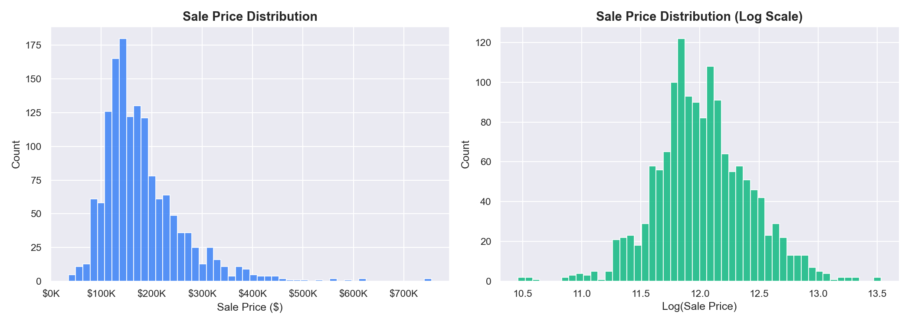
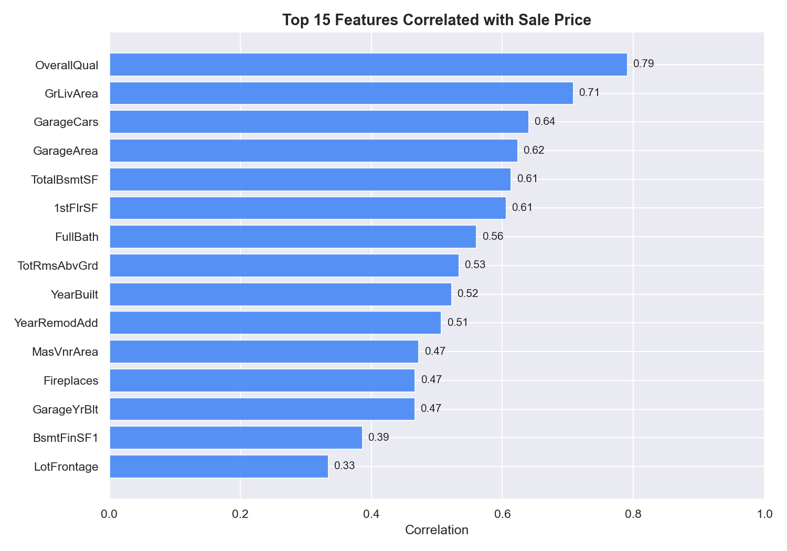
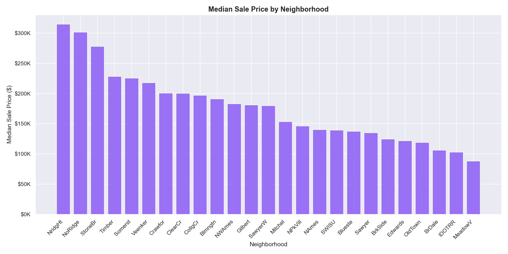
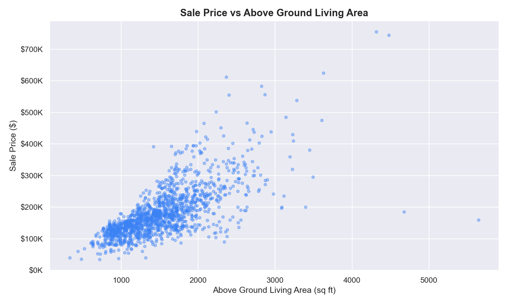
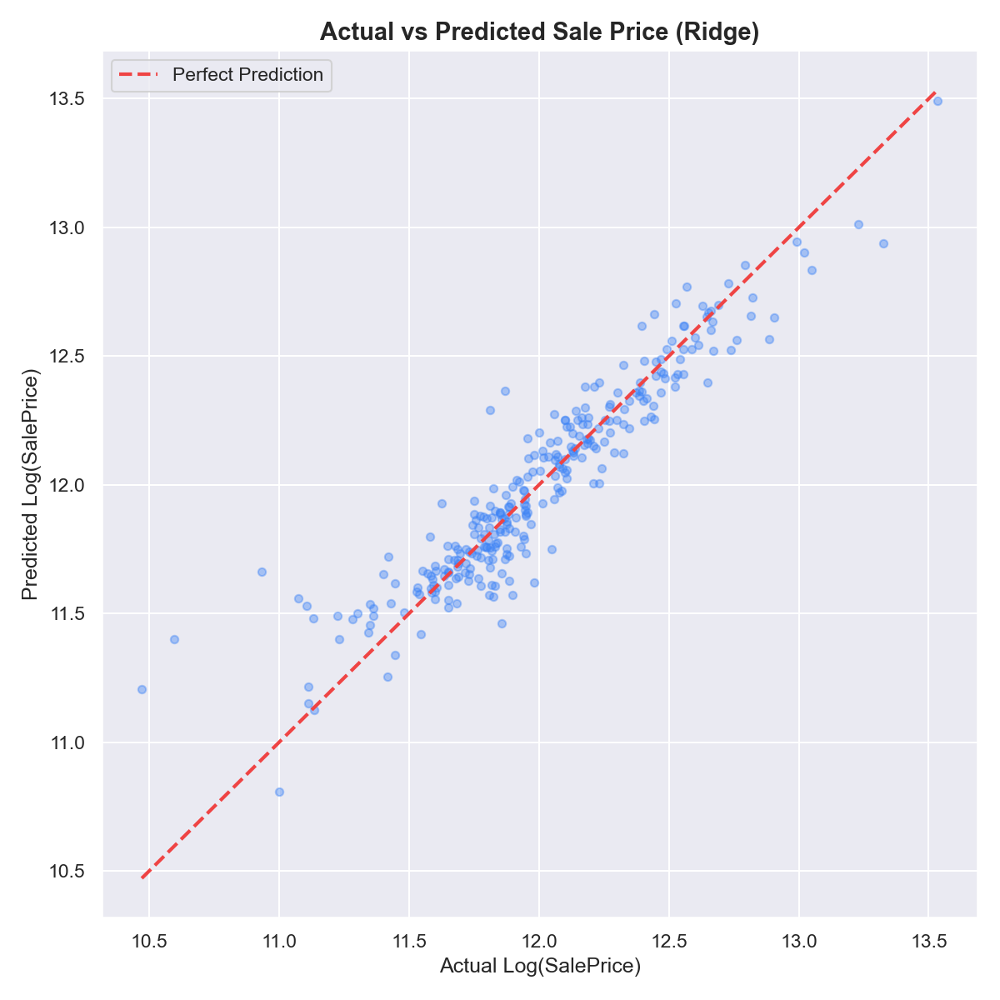
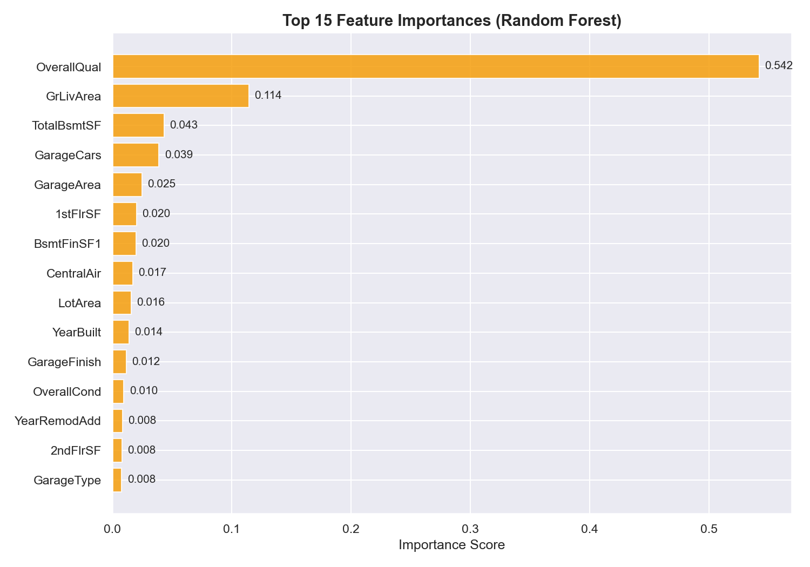

# 🏠 HousePricer — House Price Prediction

A machine learning project that predicts house sale prices using Linear Regression, Ridge Regression and Random Forest. Built on the Ames Housing dataset covering 1,460 properties with 80+ features.

---

## 📋 Table of Contents

- 🎯 Project Overview
- 📊 Key Questions Answered
- 📈 Visualizations
- 🛠️ Technologies Used
- 📁 Project Structure
- 🚀 How to Run
- 💡 Key Findings
- 👨‍💻 Author

---

## 🎯 Project Overview

This project applies supervised machine learning to predict residential property sale prices in Ames, Iowa. The dataset contains 1,460 houses with 80+ features covering physical characteristics, location, quality ratings and sale conditions.

The analysis covers:
- Exploratory data analysis and feature correlation
- Data cleaning and preprocessing
- Feature engineering and encoding
- Model training — Linear Regression and Ridge Regression
- Feature importance analysis using Random Forest
- Model evaluation with R², RMSE and MAE

---

## 📊 Key Questions Answered

- What is the distribution of house sale prices?
- Which features correlate most strongly with sale price?
- How does neighbourhood affect property value?
- How well can Linear and Ridge Regression predict sale prices?
- Which features are most important according to Random Forest?

---

## 📈 Visualizations

### Sale Price Distribution


### Top 15 Features Correlated with Sale Price


### Median Sale Price by Neighbourhood


### Sale Price vs Above Ground Living Area


### Actual vs Predicted Sale Price (Ridge)


### Top 15 Feature Importances (Random Forest)


---

## 🛠️ Technologies Used

- **Language:** Python 3.12
- **Data Manipulation:** Pandas, NumPy
- **Machine Learning:** Scikit-learn
- **Visualization:** Matplotlib, Seaborn
- **Environment:** Jupyter Notebook

---

## 📁 Project Structure

```
HousePricer/
├── analysis.ipynb          ← Main analysis notebook
├── requirements.txt
├── LICENSE
├── README.md
├── data/
│   └── train.csv           ← Raw dataset (not tracked by git)
└── outputs/
    ├── price_distribution.png
    ├── feature_correlation.png
    ├── price_by_neighborhood.png
    ├── price_vs_area.png
    ├── actual_vs_predicted.png
    └── feature_importance.png
```

---

## 🚀 How to Run

**1. Install dependencies:**
```bash
pip install -r requirements.txt
```

**2. Download the dataset:**

Get `train.csv` from [Kaggle](https://www.kaggle.com/datasets/lespin/house-prices-dataset) and place it inside the `data/` folder.

**3. Run the notebook:**
```bash
jupyter notebook analysis.ipynb
```

Run all cells top to bottom. Charts will be saved automatically to `outputs/`.

---

## 💡 Key Findings

- Sale prices follow a right-skewed distribution — log transformation improves model performance
- **Overall quality**, **living area** and **garage size** are the strongest predictors of sale price
- Neighbourhood has a significant impact — top neighbourhoods command nearly 3x the median price
- Ridge Regression outperforms standard Linear Regression by reducing overfitting
- Random Forest confirms that physical size and quality features dominate price prediction

---

## 👨‍💻 Author

**Berke Arda Turk**  
Data Science & AI Enthusiast | Computer Science (B.ASc)  
[🌐 Portfolio](https://berkeardaturk.com) · [💼 LinkedIn](https://www.linkedin.com/in/berke-arda-turk/) · [🐙 GitHub](https://github.com/Mood07)
